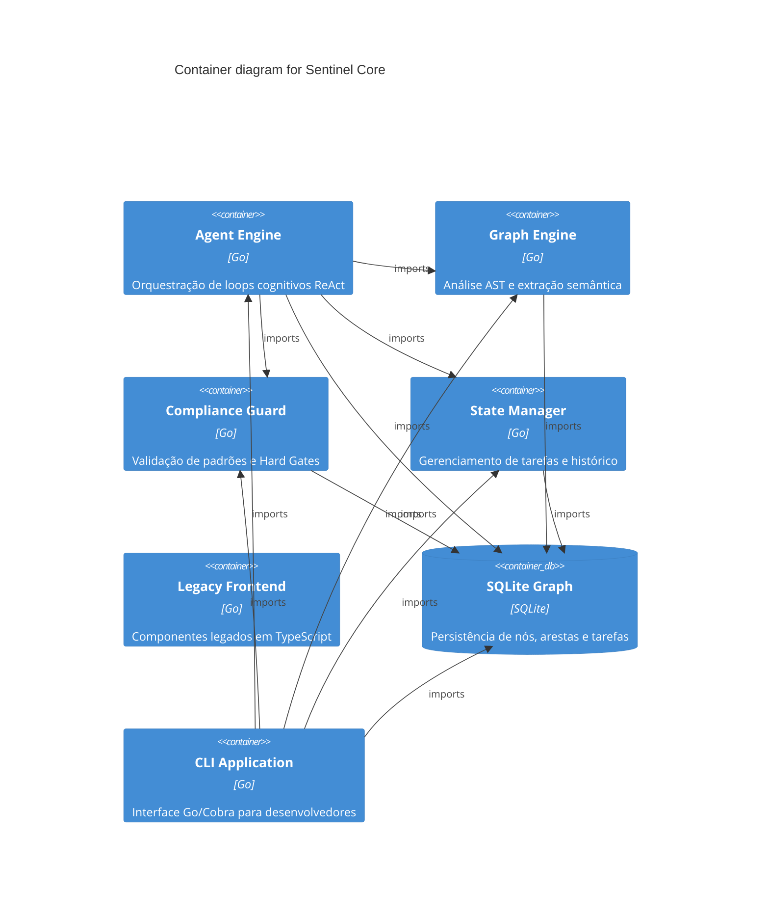

# System Container Architecture (C4 Level 2) [PID-SENTINEL]

Este diagrama mostra os containers lógicos do Sentinel e como eles se comunicam.

```mermaid
C4Container
    title Container diagram for Sentinel Core

    Container(agents, "Agent Engine", "Go", "Orquestração de loops cognitivos ReAct")
    Container(graph, "Graph Engine", "Go", "Análise AST e extração semântica")
    Container(audit, "Compliance Guard", "Go", "Validação de padrões e Hard Gates")
    Container(state, "State Manager", "Go", "Gerenciamento de tarefas e histórico")
    Container(frontend, "Legacy Frontend", "Go", "Componentes legados em TypeScript")
    ContainerDb(db, "SQLite Graph", "SQLite", "Persistência de nós, arestas e tarefas")
    Container(cli, "CLI Application", "Go", "Interface Go/Cobra para desenvolvedores")

    Rel(audit, db, "imports")
    Rel(state, db, "imports")
    Rel(cli, graph, "imports")
    Rel(cli, agents, "imports")
    Rel(agents, audit, "imports")
    Rel(graph, db, "imports")
    Rel(cli, db, "imports")
    Rel(cli, audit, "imports")
    Rel(cli, state, "imports")
    Rel(agents, graph, "imports")
    Rel(agents, state, "imports")
    Rel(agents, db, "imports")
```
