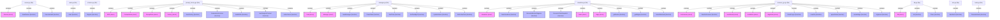

# Project Master Architecture [PID-SENTINEL]

> [!IMPORTANT]
> This is an auto-generated live map of the codebase.

```mermaid
graph TD
    file_internal_audit_runner_go["runner.go (file)"]
    struct_internal_audit_runner_go_Runner["Runner (struct)"]:::struct
    func_internal_audit_runner_go_NewRunner["NewRunner (function)"]:::func
    func_internal_audit_runner_go_ExecuteAudit["ExecuteAudit (function)"]:::func
    file_cmd_sentinel_main_go["main.go (file)"]
    func_cmd_sentinel_main_go_main["main (function)"]:::func
    file_internal_graph_schema_go["schema.go (file)"]
    func_internal_graph_schema_go_Migrate["Migrate (function)"]:::func
    file_internal_bridge_prompt_factory_go["prompt_factory.go (file)"]
    struct_internal_bridge_prompt_factory_go_ADR["ADR (struct)"]:::struct
    struct_internal_bridge_prompt_factory_go_ContextNode["ContextNode (struct)"]:::struct
    struct_internal_bridge_prompt_factory_go_PromptData["PromptData (struct)"]:::struct
    struct_internal_bridge_prompt_factory_go_Factory["Factory (struct)"]:::struct
    func_internal_bridge_prompt_factory_go_NewFactory["NewFactory (function)"]:::func
    func_internal_bridge_prompt_factory_go_GenerateInstruction["GenerateInstruction (function)"]:::func
    func_internal_bridge_prompt_factory_go_loadADRs["loadADRs (function)"]:::func
    func_internal_bridge_prompt_factory_go_loadSurgicalContext["loadSurgicalContext (function)"]:::func
    func_internal_bridge_prompt_factory_go_extractLines["extractLines (function)"]:::func
    file_internal_state_manager_go["manager.go (file)"]
    struct_internal_state_manager_go_Task["Task (struct)"]:::struct
    struct_internal_state_manager_go_Manager["Manager (struct)"]:::struct
    func_internal_state_manager_go_NewManager["NewManager (function)"]:::func
    func_internal_state_manager_go_CreateTask["CreateTask (function)"]:::func
    func_internal_state_manager_go_StartTask["StartTask (function)"]:::func
    func_internal_state_manager_go_GetTaskByID["GetTaskByID (function)"]:::func
    func_internal_state_manager_go_UpdateStatus["UpdateStatus (function)"]:::func
    func_internal_state_manager_go_GetActiveTask["GetActiveTask (function)"]:::func
    file_internal_graph_visualizer_go["visualizer.go (file)"]
    file_internal_graph_scanner_go_go["scanner_go.go (file)"]
    file_pkg_sqlite_db_go["db.go (file)"]
    struct_pkg_sqlite_db_go_DB["DB (struct)"]:::struct
    func_pkg_sqlite_db_go_Init["Init (function)"]:::func
    func_pkg_sqlite_db_go_Close["Close (function)"]:::func
    struct_internal_graph_visualizer_go_Visualizer["Visualizer (struct)"]:::struct
    func_internal_graph_visualizer_go_NewVisualizer["NewVisualizer (function)"]:::func
    func_internal_graph_visualizer_go_GenerateMasterDiagram["GenerateMasterDiagram (function)"]:::func
    func_internal_graph_visualizer_go_GenerateTaskSnapshot["GenerateTaskSnapshot (function)"]:::func
    struct_internal_graph_visualizer_go_Node["Node (struct)"]:::struct
    struct_internal_graph_visualizer_go_Edge["Edge (struct)"]:::struct
    func_internal_graph_visualizer_go_getNodes["getNodes (function)"]:::func
    func_internal_graph_visualizer_go_getEdges["getEdges (function)"]:::func
    func_internal_graph_visualizer_go_formatMermaid["formatMermaid (function)"]:::func
    struct_internal_graph_scanner_go_go_GoScanner["GoScanner (struct)"]:::struct
    func_internal_graph_scanner_go_go_NewGoScanner["NewGoScanner (function)"]:::func
    struct_internal_graph_scanner_go_go_scanResult["scanResult (struct)"]:::struct
    struct_internal_graph_scanner_go_go_nodeData["nodeData (struct)"]:::struct
    struct_internal_graph_scanner_go_go_edgeData["edgeData (struct)"]:::struct
    func_internal_graph_scanner_go_go_ScanProject["ScanProject (function)"]:::func
    func_internal_graph_scanner_go_go_scanFile["scanFile (function)"]:::func
    func_internal_graph_scanner_go_go_upsertNode["upsertNode (function)"]:::func
    func_internal_graph_scanner_go_go_createEdge["createEdge (function)"]:::func
    func_internal_graph_scanner_go_go_isIgnored["isIgnored (function)"]:::func
    file_pkg_utils_text_go["text.go (file)"]
    func_pkg_utils_text_go_SanitizeID["SanitizeID (function)"]:::func
    file_pkg_utils_hash_go["hash.go (file)"]
    func_pkg_utils_hash_go_CalculateHash["CalculateHash (function)"]:::func
    file_internal_audit_runner_go -->|contains| struct_internal_audit_runner_go_Runner
    file_internal_audit_runner_go -->|contains| func_internal_audit_runner_go_NewRunner
    file_internal_audit_runner_go -->|contains| func_internal_audit_runner_go_ExecuteAudit
    file_cmd_sentinel_main_go -->|contains| func_cmd_sentinel_main_go_main
    file_internal_graph_schema_go -->|contains| func_internal_graph_schema_go_Migrate
    file_internal_bridge_prompt_factory_go -->|contains| struct_internal_bridge_prompt_factory_go_ADR
    file_internal_bridge_prompt_factory_go -->|contains| struct_internal_bridge_prompt_factory_go_ContextNode
    file_internal_bridge_prompt_factory_go -->|contains| struct_internal_bridge_prompt_factory_go_PromptData
    file_internal_bridge_prompt_factory_go -->|contains| struct_internal_bridge_prompt_factory_go_Factory
    file_internal_bridge_prompt_factory_go -->|contains| func_internal_bridge_prompt_factory_go_NewFactory
    file_internal_bridge_prompt_factory_go -->|contains| func_internal_bridge_prompt_factory_go_GenerateInstruction
    file_internal_bridge_prompt_factory_go -->|contains| func_internal_bridge_prompt_factory_go_loadADRs
    file_internal_bridge_prompt_factory_go -->|contains| func_internal_bridge_prompt_factory_go_loadSurgicalContext
    file_internal_bridge_prompt_factory_go -->|contains| func_internal_bridge_prompt_factory_go_extractLines
    file_internal_state_manager_go -->|contains| struct_internal_state_manager_go_Task
    file_internal_state_manager_go -->|contains| struct_internal_state_manager_go_Manager
    file_internal_state_manager_go -->|contains| func_internal_state_manager_go_NewManager
    file_internal_state_manager_go -->|contains| func_internal_state_manager_go_CreateTask
    file_internal_state_manager_go -->|contains| func_internal_state_manager_go_StartTask
    file_internal_state_manager_go -->|contains| func_internal_state_manager_go_GetTaskByID
    file_internal_state_manager_go -->|contains| func_internal_state_manager_go_UpdateStatus
    file_internal_state_manager_go -->|contains| func_internal_state_manager_go_GetActiveTask
    file_internal_graph_visualizer_go -->|contains| struct_internal_graph_visualizer_go_Visualizer
    file_internal_graph_visualizer_go -->|contains| func_internal_graph_visualizer_go_NewVisualizer
    file_internal_graph_visualizer_go -->|contains| func_internal_graph_visualizer_go_GenerateMasterDiagram
    file_internal_graph_visualizer_go -->|contains| func_internal_graph_visualizer_go_GenerateTaskSnapshot
    file_internal_graph_visualizer_go -->|contains| struct_internal_graph_visualizer_go_Node
    file_internal_graph_visualizer_go -->|contains| struct_internal_graph_visualizer_go_Edge
    file_internal_graph_visualizer_go -->|contains| func_internal_graph_visualizer_go_getNodes
    file_internal_graph_visualizer_go -->|contains| func_internal_graph_visualizer_go_getEdges
    file_internal_graph_visualizer_go -->|contains| func_internal_graph_visualizer_go_formatMermaid
    file_internal_graph_scanner_go_go -->|contains| struct_internal_graph_scanner_go_go_GoScanner
    file_internal_graph_scanner_go_go -->|contains| func_internal_graph_scanner_go_go_NewGoScanner
    file_internal_graph_scanner_go_go -->|contains| struct_internal_graph_scanner_go_go_scanResult
    file_internal_graph_scanner_go_go -->|contains| struct_internal_graph_scanner_go_go_nodeData
    file_internal_graph_scanner_go_go -->|contains| struct_internal_graph_scanner_go_go_edgeData
    file_internal_graph_scanner_go_go -->|contains| func_internal_graph_scanner_go_go_ScanProject
    file_internal_graph_scanner_go_go -->|contains| func_internal_graph_scanner_go_go_scanFile
    file_internal_graph_scanner_go_go -->|contains| func_internal_graph_scanner_go_go_upsertNode
    file_internal_graph_scanner_go_go -->|contains| func_internal_graph_scanner_go_go_createEdge
    file_internal_graph_scanner_go_go -->|contains| func_internal_graph_scanner_go_go_isIgnored
    file_pkg_sqlite_db_go -->|contains| struct_pkg_sqlite_db_go_DB
    file_pkg_sqlite_db_go -->|contains| func_pkg_sqlite_db_go_Init
    file_pkg_sqlite_db_go -->|contains| func_pkg_sqlite_db_go_Close
    file_pkg_utils_text_go -->|contains| func_pkg_utils_text_go_SanitizeID
    file_pkg_utils_hash_go -->|contains| func_pkg_utils_hash_go_CalculateHash

    classDef struct fill:#f9f,stroke:#333,stroke-width:2px;
    classDef func fill:#bbf,stroke:#333,stroke-width:1px;
```
