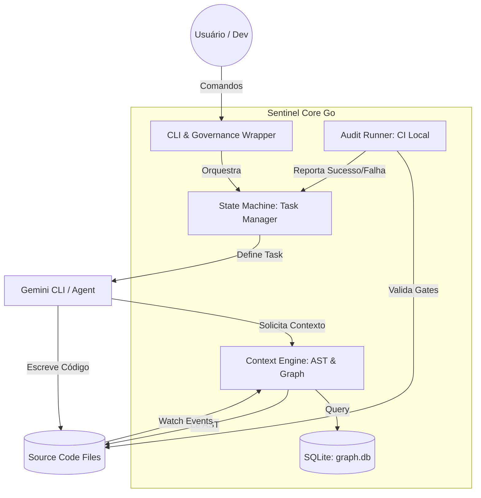

# Sentinel Core: System Design & Architecture [PID-SENTINEL]

## 1. Contexto e Visão
O Sentinel é um **Governance Wrapper** e **Context Engine** de alta performance, projetado para garantir o rigor arquitetural em projetos desenvolvidos assistidos por IA. Ele atua como um orquestrador entre o usuário (leigo ou dev), o código fonte (AST) e o Agente de IA (Gemini CLI).

## 2. ADR-001: Reescrita em Go com SQLite Indexing
*   **Decisão**: Migrar o core de TypeScript para Go.
*   **Motivação**: Binário único sem dependências, performance massiva para análise de AST e concorrência nativa para file watching.
*   **Estratégia de Memória**: Uso de SQLite local (`.sentinel/graph.db`) para persistir o grafo de dependências e estados de tarefas, garantindo "memória perfeita" entre sessões.

## 3. C4 Model - Container Diagram (Mermaid)

## 4. O Sistema "À Prova de Falhas" (The Gates)
1.  **Deterministic Planning**: Nenhuma tarefa de código começa sem um `plan.md` estruturado.
2.  **Surgical Context**: A IA recebe apenas os nós do grafo impactados pela tarefa.
3.  **Audit Gate**: O Sentinel executa comandos de build/teste (Audit Runner) após cada tarefa. Se falhar, o estado da tarefa volta para "Pending" e o commit é bloqueado.
4.  **Atomic Commits**: Cada tarefa aprovada gera um commit automático com o identificador `[PID-SENTINEL]`.

---
*Assinado: Sentinel Sovereign Protocol v5.0.0*
