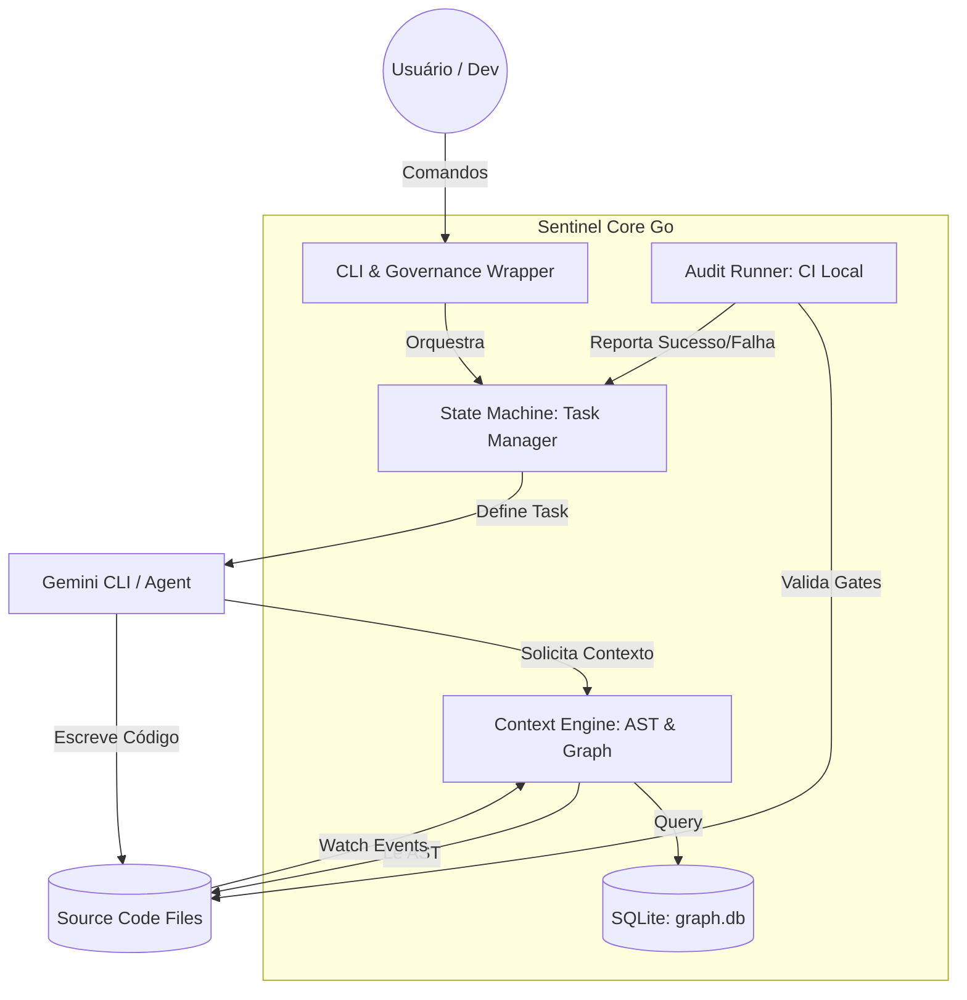

# Sentinel Core: System Design & Architecture [PID-SENTINEL]

## 1. Contexto e Visão
O Sentinel é um **Governance Wrapper** e **Context Engine** de alta performance, projetado para garantir o rigor arquitetural em projetos desenvolvidos assistidos por IA. Ele atua como um orquestrador entre o usuário (leigo ou dev), o código fonte (AST) e o Agente de IA (Gemini CLI).

## 2. ADR-001: Reescrita em Go com SQLite Indexing
*   **Decisão**: Migrar o core de TypeScript para Go.
*   **Motivação**: Binário único sem dependências, performance massiva para análise de AST e concorrência nativa para file watching.
*   **Estratégia de Memória**: Uso de SQLite local (`.sentinel/graph.db`) para persistir o grafo de dependências e estados de tarefas, garantindo "memória perfeita" entre sessões.

## 3. C4 Model - Container Diagram (Mermaid)

## 5. Estratégia de Estado Híbrido (MD + SQLite)
O Sentinel utiliza uma arquitetura de **Reconciliação Proativa**:
- **Interface (.md)**: `spec.md` e `plan.md` são as interfaces de leitura/escrita para Humanos e IA.
- **Núcleo (.db)**: O SQLite armazena a "Verdade Fria" (hashes de arquivos, status real de auditoria, grafo de dependências).
- **Sincronização**: O `Reconciliation Engine` monitora alterações nos arquivos Markdown. Se um humano/IA marcar uma task como concluída, o Sentinel intercepta, dispara o `Audit Runner` e valida se a "Verdade Fria" autoriza a mudança na "Interface".

## 6. Audit Runner (The Fail-Safe Gate)
Nenhuma transição para o estado `DONE` é permitida sem:
1. **Exit Code 0**: O comando de verificação definido na Task deve passar.
2. **AST Integrity**: O grafo de dependências deve ser atualizado e validado após a mudança.
3. **Traceability**: O log de auditoria deve ser persistido no SQLite antes do commit.

## 7. The Subagent Triad Architecture
Para evitar a poluição de contexto e garantir a escalabilidade, o Sentinel opera sob a **Tríade de Engenharia**:

1.  **The Warden (Sentinel Core Go)**: O Guardião do Estado. Gerencia o SQLite, extrai o contexto AST (Corte Cirúrgico), gera o Prompt de Instrução e executa o Audit Runner (Gate). Ele não escreve código.
2.  **The Chief Engineer (Gemini CLI Main)**: O Orquestrador. Ele lê os planos do Sentinel, toma decisões de alto nível e despacha tarefas para os Operários via ferramenta `invoke_agent`.
3.  **The Operators (Subagents)**: Os Operários Efêmeros. IAs especializadas e descartáveis que recebem uma única instrução do Sentinel, modificam o código e retornam o controle. Seus erros são capturados pelo Warden e reportados ao Chief Engineer.

---
*Assinado: Sentinel Sovereign Protocol v5.0.0*
